Baltimore Arrests Data Analysis
================

Loading and cleaning the data.
==============================

``` r
## libraries  =====================================================================================

library(ggplot2)
library(dplyr)
```

    ## 
    ## Attaching package: 'dplyr'

    ## The following objects are masked from 'package:stats':
    ## 
    ##     filter, lag

    ## The following objects are masked from 'package:base':
    ## 
    ##     intersect, setdiff, setequal, union

``` r
library(tidyr)
library(stringr)
library(ggthemes)
library(ggmap)

## input  ========================================================================================

arrests <- read.csv("BPD_Arrests.csv")
str(arrests)
```

    ## 'data.frame':    130713 obs. of  15 variables:
    ##  $ Arrest           : int  16160529 16160490 16160487 16160485 16160481 16160461 16160451 16160447 16160449 16160438 ...
    ##  $ Age              : int  54 22 31 31 33 39 54 39 46 20 ...
    ##  $ Sex              : Factor w/ 2 levels "F","M": 2 2 2 2 2 1 2 2 2 2 ...
    ##  $ Race             : Factor w/ 5 levels "A","B","I","U",..: 2 2 2 2 2 5 2 5 1 4 ...
    ##  $ ArrestDate       : Factor w/ 1412 levels "01/01/2013","01/01/2014",..: 1265 1265 1265 1265 1265 1265 1265 1265 1265 1265 ...
    ##  $ ArrestTime       : Factor w/ 2313 levels "0.00","0.01",..: 1972 1889 1880 1775 1646 1455 1345 1345 1262 1255 ...
    ##  $ ArrestLocation   : Factor w/ 10325 levels "","0 1ST AVE",..: 5717 4759 1 1 1 1 1 1 1709 7808 ...
    ##  $ IncidentOffense  : Factor w/ 271 levels "102-Questional Death",..: 149 270 270 270 270 270 270 270 270 149 ...
    ##  $ IncidentLocation : Factor w/ 15406 levels "","#NAME?","** Detail ***",..: 7556 6259 1 1 1 1 1 1 2162 10305 ...
    ##  $ Charge           : Factor w/ 587 levels "","1 0002","1 0005",..: 212 566 27 27 410 27 27 27 449 212 ...
    ##  $ ChargeDescription: Factor w/ 11650 levels "","(Driving, Attempting To Drive)",..: 6392 9710 7874 7874 9182 7874 7874 7874 11405 6392 ...
    ##  $ District         : Factor w/ 10 levels "","Central","Eastern",..: 4 9 1 1 1 1 1 1 8 7 ...
    ##  $ Post             : int  432 833 NA NA NA NA NA NA 941 221 ...
    ##  $ Neighborhood     : Factor w/ 551 levels "","Abell","ABELL",..: 24 245 1 1 1 1 1 1 68 299 ...
    ##  $ Location.1       : Factor w/ 21261 levels "","(39.2004059842, -76.5560161338)",..: 15270 2986 1 1 1 1 1 1 2079 8518 ...

``` r
summary(arrests)
```

    ##      Arrest              Age         Sex        Race      
    ##  Min.   :13610381   Min.   :  0.00   F: 24876   A:   343  
    ##  1st Qu.:13760769   1st Qu.: 24.00   M:105837   B:106652  
    ##  Median :14120632   Median : 30.00              I:   375  
    ##  Mean   :14524682   Mean   : 32.97              U:  2660  
    ##  3rd Qu.:15123494   3rd Qu.: 41.00              W: 20683  
    ##  Max.   :16160529   Max.   :100.00                        
    ##  NA's   :7014       NA's   :28                            
    ##       ArrestDate       ArrestTime                ArrestLocation 
    ##  08/15/2013:   186   19:00  :  2063                     :52118  
    ##  01/09/2014:   182   18:00  :  2029   200 N EUTAW ST    :  447  
    ##  05/29/2013:   178   20:00  :  2019   1600 W NORTH AVE  :  344  
    ##  04/23/2014:   175   11:00  :  1998   1500 RUSSELL ST   :  306  
    ##  03/06/2014:   172   13:00  :  1967   400 E LEXINGTON ST:  297  
    ##  03/13/2013:   171   12:00  :  1878   300 N EUTAW ST    :  237  
    ##  (Other)   :129649   (Other):118759   (Other)           :76964  
    ##                 IncidentOffense            IncidentLocation
    ##  Unknown Offense        :82046                     :53726  
    ##  87-Narcotics           :12294   200 N Eutaw St    :  473  
    ##  4E-Common Assault      : 6304   400 W Lexington St:  240  
    ##  UNKNOWN OFFENSE        : 3209   300 N Eutaw St    :  235  
    ##  87O-Narcotics (Outside): 2602   1500 Russell St   :  222  
    ##  6C-Larceny- Shoplifting: 2222   400 E Baltimore St:  221  
    ##  (Other)                :22036   (Other)           :75596  
    ##      Charge                                             ChargeDescription
    ##  4 3550 :19116   Failure To Appear || Failure To Appear          :15373  
    ##  1 1415 :18138   Unknown Charge                                  : 7790  
    ##         :16458   Asslt-Sec Degree || Assault-Sec Degree          : 7769  
    ##  1 0077 :16269   Cds:Possess-Not Marihuana || Cds Violation      : 5873  
    ##  1 1635 : 5255   Cds:Possess-Not Marihuana || Cds                : 3760  
    ##  1 0573 : 4247   Violation Of Probation || Violation Of Probation: 3041  
    ##  (Other):51230   (Other)                                         :87107  
    ##          District          Post                    Neighborhood  
    ##              :52112   Min.   :111.0                      :52118  
    ##  Southern    :11084   1st Qu.:312.0   DOWNTOWN           : 2581  
    ##  Eastern     :10449   Median :516.0   SANDTOWN-WINCHESTER: 1708  
    ##  Western     :10202   Mean   :521.5   CARROLLTON RIDGE   : 1572  
    ##  Southeastern: 9854   3rd Qu.:733.0   BROADWAY EAST      : 1480  
    ##  Northeastern: 8967   Max.   :945.0   PENN NORTH         : 1442  
    ##  (Other)     :28045   NA's   :52130   (Other)            :69812  
    ##                            Location.1   
    ##                                 :52047  
    ##  (39.2915696972, -76.6210983902):  401  
    ##  (39.3100495075, -76.6434028230):  322  
    ##  (39.2913120768, -76.6100972198):  300  
    ##  (39.2740805921, -76.6276929303):  221  
    ##  (39.2929794458, -76.6211885580):  219  
    ##  (Other)                        :77203

``` r
## extracting date ================================================================================

arrests$ArrestDate <- as.POSIXct(strptime(arrests$ArrestDate, format = "%m/%d/%Y"))
arrests$ArrestTime <- as.POSIXct(strptime(as.character(arrests$ArrestTime), format = "%H:%M"))

# extracting day
arrests$Day <- as.integer(format(arrests$ArrestDate, "%d"))

# extracting month
arrests$Month <- as.factor(format(arrests$ArrestDate, "%B"))
arrests$Month <- ordered(arrests$Month,
        levels = c("January","February","March","April","May",
                    "June","July","August","September","October","November","December"))

# extracting year
arrests$Year <- as.factor(format(arrests$ArrestDate, "%Y"))

# extracting weekday
arrests$Weekday <- as.character(format(arrests$ArrestDate, "%A"))
arrests$Weekday <- ordered(arrests$Weekday, levels = c("Monday","Tuesday",
                    "Wednesday","Thursday","Friday","Saturday","Sunday"))

table(arrests$Weekday)
```

    ## 
    ##    Monday   Tuesday Wednesday  Thursday    Friday  Saturday    Sunday 
    ##     17577     21769     22410     21941     20015     15138     11863

``` r
# extracting hour
arrests$Hour <- as.character(format(arrests$ArrestTime, "%H"))
arrests$Hour[arrests$Hour == "03"|arrests$Hour == "04"|arrests$Hour == "05"|
                 arrests$Hour == "06"|arrests$Hour == "07"|
                 arrests$Hour == "08"] <- "Morning (3am to 8am)"

arrests$Hour[arrests$Hour == "09"|arrests$Hour == "10"|arrests$Hour == "11"|
                 arrests$Hour == "12"|arrests$Hour == "13"|
                 arrests$Hour == "14"] <- "Daytime (9am to 2pm)"

arrests$Hour[arrests$Hour == "15"|arrests$Hour == "16"|arrests$Hour == "17"|
                 arrests$Hour == "18"|arrests$Hour == "19"|
                 arrests$Hour == "20"] <- "Evening (3pm to 8pm)"

arrests$Hour[arrests$Hour == "21"|arrests$Hour == "22"|arrests$Hour == "23"|
                 arrests$Hour == "00"|arrests$Hour == "01"|
                 arrests$Hour == "02"] <- "Night (9pm to 2am)"

arrests$Hour <- factor(arrests$Hour, levels = c(
    "Morning (3am to 8am)","Daytime (9am to 2pm)",
    "Evening (3pm to 8pm)","Night (9pm to 2am)"))

## cleaning the data =============================================================================

arrests$Arrest <- NULL

arrests$Sex <- as.character(arrests$Sex)
arrests$Sex[arrests$Sex == "M"] <- "Male"
arrests$Sex[arrests$Sex == "F"] <- "Female"
arrests$Sex <- factor(arrests$Sex)

arrests$ArrestLocation <- as.character(arrests$ArrestLocation)
arrests$IncidentLocation <- as.character(arrests$IncidentLocation)
arrests$ChargeDescription <- as.character(arrests$ChargeDescription)

arrests$District <- as.character(arrests$District)
arrests$District[arrests$District == ""] <- NA
arrests$District <- as.factor(arrests$District)

arrests$Neighborhood <- as.character(arrests$Neighborhood)
arrests$Neighborhood <- tolower(arrests$Neighborhood)
arrests$Neighborhood[arrests$Neighborhood == ""] <- NA
arrests$Neighborhood <- as.factor(arrests$Neighborhood)

arrests$Location.1 <- as.character(arrests$Location.1)
arrests$Location.1[arrests$Location.1 == ""] <- NA
arrests$Location.1 <- gsub("\\(|\\)| ","",arrests$Location.1)
arrests <- separate(arrests, Location.1, c("Latitude","Longitude"), sep = ",")
arrests$Latitude <- as.numeric(arrests$Latitude)
arrests$Longitude <- as.numeric(arrests$Longitude)

arrests$IncidentLocation <- as.character(arrests$IncidentLocation)
arrests$IncidentLocation[arrests$IncidentLocation == ""] <- NA
arrests$IncidentLocation <- tolower(arrests$IncidentLocation)

arrests$District <- as.character(arrests$District)
arrests$District[arrests$District == ""] <- NA
arrests$District <- as.factor(arrests$District)

arrests$IncidentOffense <- as.character(arrests$IncidentOffense)
arrests$IncidentOffense[arrests$IncidentOffense == ""] <- NA
arrests$IncidentOffense <- str_extract(arrests$IncidentOffense,
                            pattern = "[-]?[ ]?[\\.a-zA-Z\\(\\) ]*$")
arrests$IncidentOffense <- gsub("[-][ ]?| ", "", arrests$IncidentOffense)
arrests$IncidentOffense <- tolower(arrests$IncidentOffense)
arrests$IncidentOffense <- as.factor(arrests$IncidentOffense)

str(arrests)
```

    ## 'data.frame':    130713 obs. of  20 variables:
    ##  $ Age              : int  54 22 31 31 33 39 54 39 46 20 ...
    ##  $ Sex              : Factor w/ 2 levels "Female","Male": 2 2 2 2 2 1 2 2 2 2 ...
    ##  $ Race             : Factor w/ 5 levels "A","B","I","U",..: 2 2 2 2 2 5 2 5 1 4 ...
    ##  $ ArrestDate       : POSIXct, format: "2016-11-12" "2016-11-12" ...
    ##  $ ArrestTime       : POSIXct, format: "2016-11-23 22:35:00" "2016-11-23 21:49:00" ...
    ##  $ ArrestLocation   : chr  "3500 PELHAM AVE" "300 S LOUDON AVE" "" "" ...
    ##  $ IncidentOffense  : Factor w/ 184 levels "","abductionbyparent",..: 59 181 181 181 181 181 181 181 181 59 ...
    ##  $ IncidentLocation : chr  "3500 pelham ave" "300 s loudon ave" NA NA ...
    ##  $ Charge           : Factor w/ 587 levels "","1 0002","1 0005",..: 212 566 27 27 410 27 27 27 449 212 ...
    ##  $ ChargeDescription: chr  "COMMON ASSAULT" "POSSESSION" "FAILURE TO APPEAR" "FAILURE TO APPEAR" ...
    ##  $ District         : Factor w/ 9 levels "Central","Eastern",..: 3 8 NA NA NA NA NA NA 7 6 ...
    ##  $ Post             : int  432 833 NA NA NA NA NA NA 941 221 ...
    ##  $ Neighborhood     : Factor w/ 279 levels "abell","allendale",..: 12 125 NA NA NA NA NA NA 35 152 ...
    ##  $ Latitude         : num  39.3 39.3 NA NA NA ...
    ##  $ Longitude        : num  -76.6 -76.7 NA NA NA ...
    ##  $ Day              : int  12 12 12 12 12 12 12 12 12 12 ...
    ##  $ Month            : Ord.factor w/ 12 levels "January"<"February"<..: 11 11 11 11 11 11 11 11 11 11 ...
    ##  $ Year             : Factor w/ 4 levels "2013","2014",..: 4 4 4 4 4 4 4 4 4 4 ...
    ##  $ Weekday          : Ord.factor w/ 7 levels "Monday"<"Tuesday"<..: 6 6 6 6 6 6 6 6 6 6 ...
    ##  $ Hour             : Factor w/ 4 levels "Morning (3am to 8am)",..: 4 4 4 3 3 3 3 3 3 3 ...

``` r
top.offences <- arrests %>% group_by(IncidentOffense) %>%
    summarise(offence.count = n()) %>% arrange(desc(offence.count)) %>% top_n(10)
```

    ## Selecting by offence.count

``` r
top.offences$IncidentOffense <- as.character(top.offences$IncidentOffense)
top.offences <- as.data.frame(top.offences)
top.offences$IncidentOffense[top.offences$IncidentOffense == "unknownoffense"|
                                 top.offences$IncidentOffense == "oth."|
                                 top.offences$IncidentOffense == "other"] <- NA
top.offences <- na.omit(top.offences)

offence.label <- c("Common Assault","Cut","Narcotics","Narcotics(Outside)",
                   "Seizure","Shop-Lifting","Towed Vehicle")
custom.color <- c("#FE654F","#4CE0B3","#004BA8","#4A525A","#FBFF12","#E3170A",
                  "#83BCA9","#17255A","#DBD2E0","#002400","#DFCC74","#6D3B47")
```

Data Analysis
=============

Visualizing on the map.
-----------------------

``` r
baltimore <- get_map(location = c(-76.7673, 39.2221, -76.4185, 39.3770), source = "osm")

ggmap(baltimore) + geom_point(alpha = 1/10, data = arrests,
                              aes(x = Longitude, y = Latitude, color = Sex)) + 
    labs(x = "Longitude", y = "Latitude", title = "Blue-Males, Brown- Females") + 
    scale_color_manual(values = c("#F4AC45","#2F195F"))
```

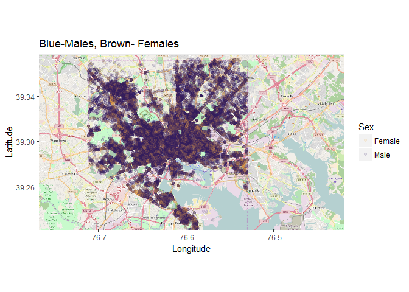

``` r
custom.color2 <- c("#F4AC45","#FF0022","#A61C3C","#9191E9","#04471C")
ggmap(baltimore) + geom_point(alpha = 1/10, data = arrests,
                              aes(x = Longitude, y = Latitude, color = Race)) + 
    labs(x = "Longitude", y = "Latitude", title = "Red- Race B, Green- Race W") + 
    scale_color_manual(values = custom.color2)
```

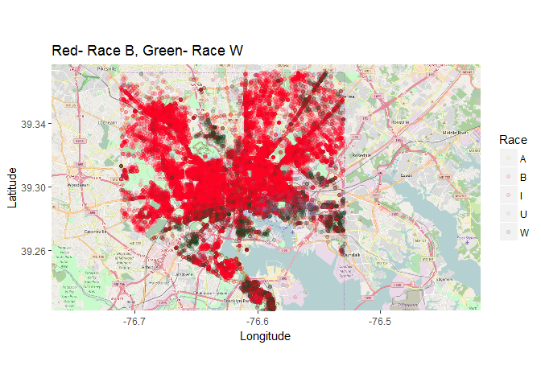

``` r
ggmap(baltimore) + geom_point(alpha = 1/5, data = subset(arrests,
                                                         arrests$IncidentOffense %in% top.offences$IncidentOffense),
                              aes(x = Longitude, y = Latitude, color = IncidentOffense)) + 
    labs(x = "Longitude", y = "Latitude", title = "") + 
    scale_color_manual(guide = guide_legend("Offence Type"),
                       labels = offence.label, values = custom.color)
```

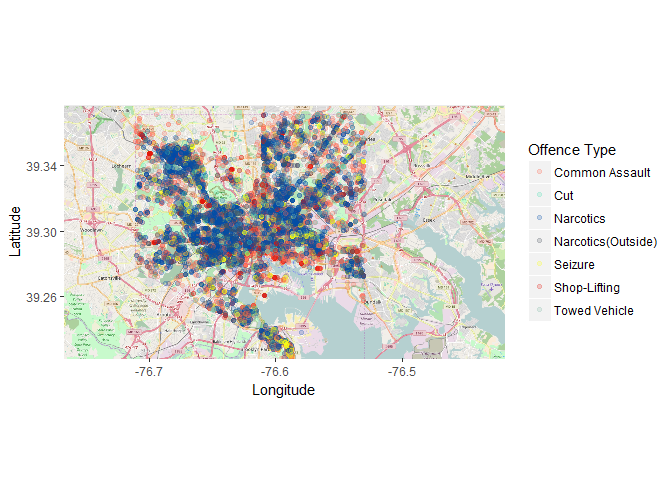

``` r
ggmap(baltimore) + geom_point(alpha = 1/10, data = arrests,
                              aes(x = Longitude, y = Latitude, color = Hour)) + 
    labs(x = "Longitude", y = "Latitude") + 
    scale_color_manual(values = c("#F4AC45","#2F195F","green","brown"))
```

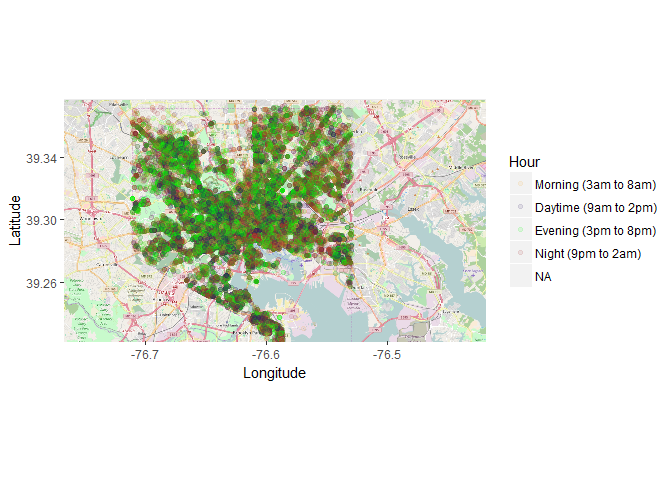

``` r
ggmap(baltimore) + geom_point(alpha = 1/10, data = arrests,
                              aes(x = Longitude, y = Latitude, color = Month)) + 
    labs(x = "Longitude", y = "Latitude") + 
    scale_color_manual(values = custom.color)
```

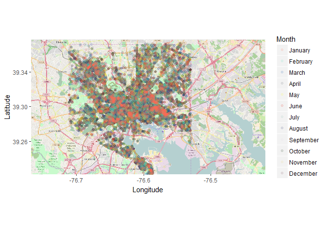

Histograms
----------

``` r
ggplot(data= arrests, aes(x = Age, fill = Race)) + geom_histogram(
    binwidth = 1, color = "black") + scale_x_continuous(
        breaks = seq(18,75,2))
```

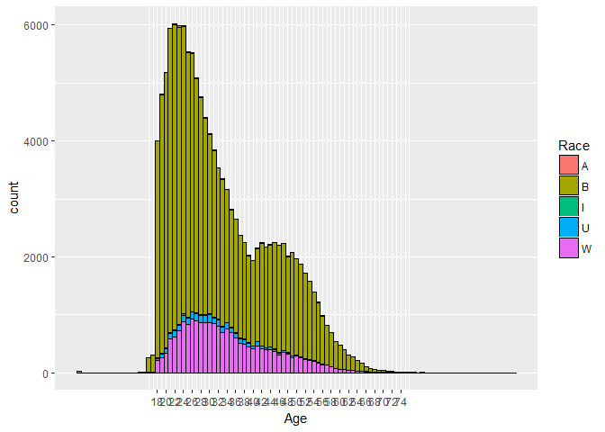

``` r
ggplot(data = arrests, aes(x = Age)) + geom_density(aes( color = Race)) +
    theme_solarized() + scale_fill_solarized()
```

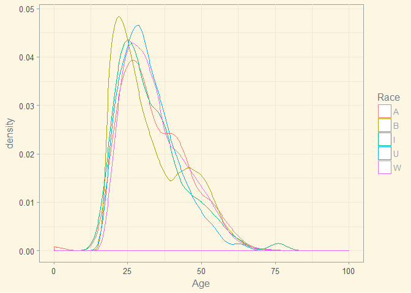

``` r
ggplot(data= na.omit(arrests), aes(x = Age, fill = District)) + geom_histogram(
    binwidth = 1, color = "black") + scale_x_continuous(
        breaks = seq(13,75,2))
```

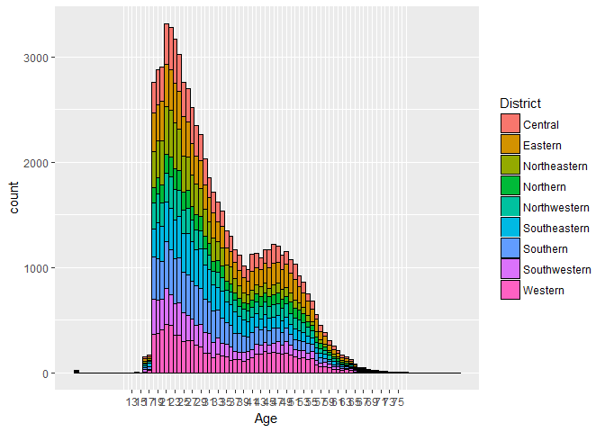

``` r
ggplot(data= na.omit(arrests), aes(x = Age, fill = Month)) + geom_histogram(
    binwidth = 1, color = "black") + scale_x_continuous(
        breaks = seq(13,75,2)) + theme_tufte() + scale_fill_tableau()
```

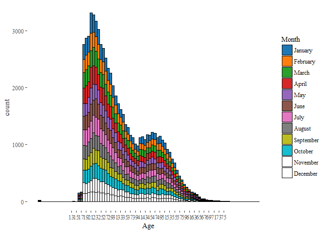

``` r
ggplot(data= na.omit(arrests), aes(x = Age, fill = Year)) + geom_histogram(
    binwidth = 1, color = "black") + scale_x_continuous(
        breaks = seq(13,75,2)) + theme_tufte() + scale_fill_tableau()
```

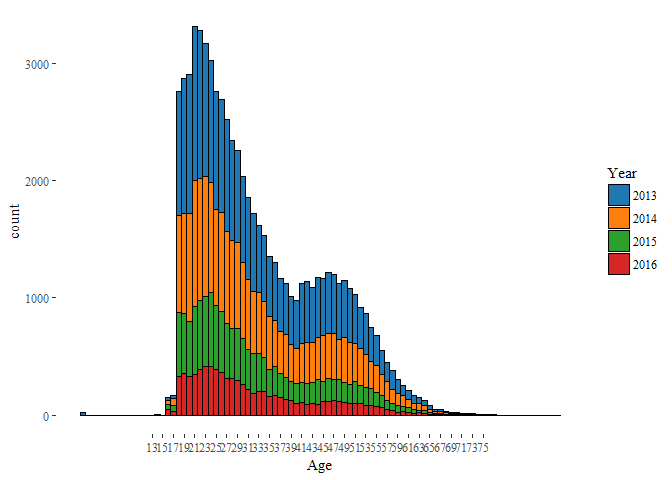

``` r
ggplot(data= na.omit(arrests), aes(x = Age, fill = Hour)) + geom_histogram(
    binwidth = 1, color = "black") + scale_x_continuous(
        breaks = seq(13,75,2)) + theme_tufte() + scale_fill_tableau()
```

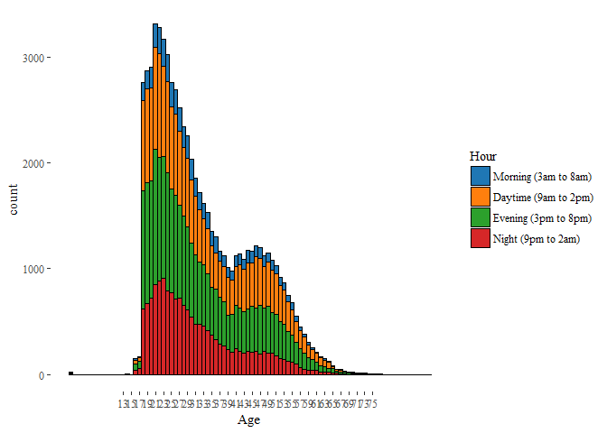

``` r
ggplot(data= na.omit(arrests), aes(x = Age, fill = Weekday)) + geom_histogram(
    binwidth = 1, color = "black") + scale_x_continuous(
        breaks = seq(13,75,2)) + theme_gdocs() + scale_fill_gdocs()
```

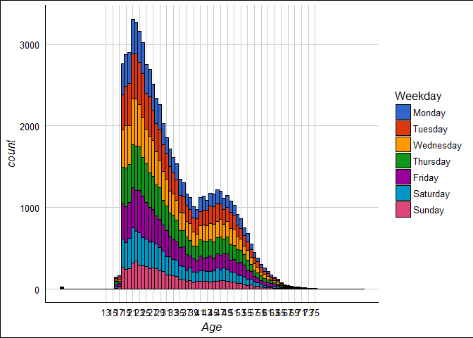

``` r
ggplot(data = arrests, aes(x = Age)) + geom_density(aes( color = Sex))
```

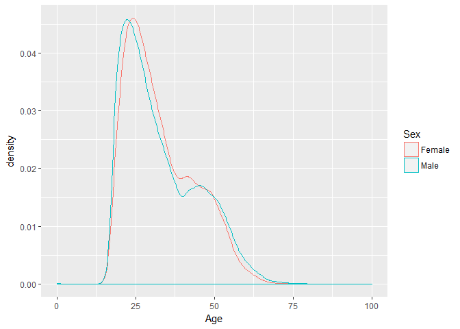

Barplots
--------

``` r
# gender

ggplot(data = arrests, aes( x = Sex, fill = Race)) + geom_bar(position = "dodge") + 
    labs(x = "Gender", y = "Number of Arrests")
```

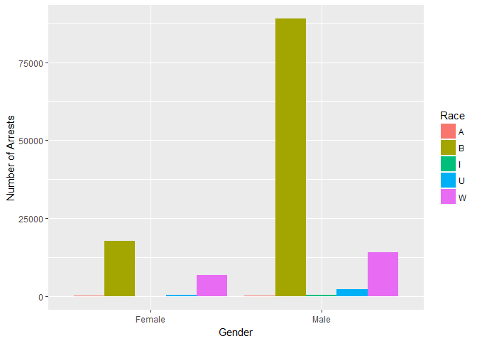

``` r
# zooming into above plot

ggplot(data = arrests, aes( x = Sex, fill = Race)) + geom_bar(position = "dodge") +
    coord_cartesian(ylim = c(0,2500)) + 
    labs(x = "Gender", y = "Number of Arrests")
```

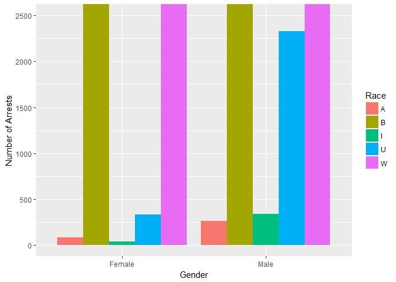

``` r
# gender and top offences

ggplot(data = subset(arrests, arrests$IncidentOffense %in% 
    top.offences$IncidentOffense),
    aes( x = Sex, fill = IncidentOffense)) + geom_bar(position = "fill") + 
    labs(x = "Gender", y = "Number of Arrests") +
    scale_fill_manual(guide = guide_legend("Offence Type"),
    labels = offence.label, values = custom.color)
```

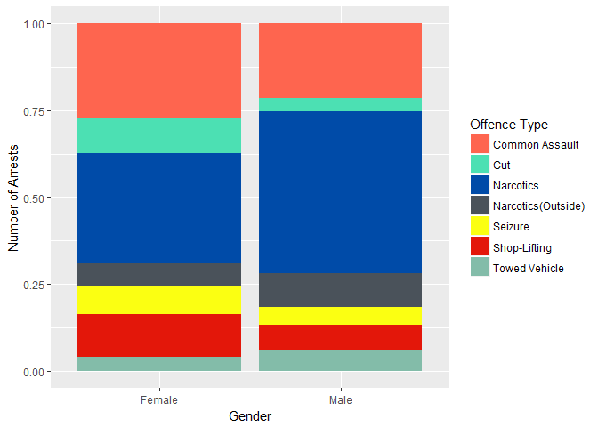

``` r
# race

ggplot(data = arrests, aes(x = Race, y = ..count../1000)) + geom_bar(fill = "#E16036")+ 
    labs(x = "Race", y = "Number of Arrests (in thousands)")
```

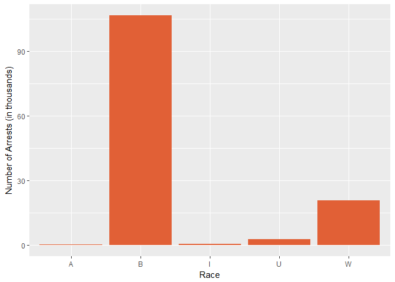

``` r
ggplot(data = subset(arrests, !is.na(arrests$Hour)), aes( x = Race, fill = Hour)) + 
    geom_bar(position = "fill") + 
    theme_solarized() + scale_fill_solarized() + 
    scale_fill_discrete(guide = guide_legend("Time"))
```

    ## Scale for 'fill' is already present. Adding another scale for 'fill',
    ## which will replace the existing scale.

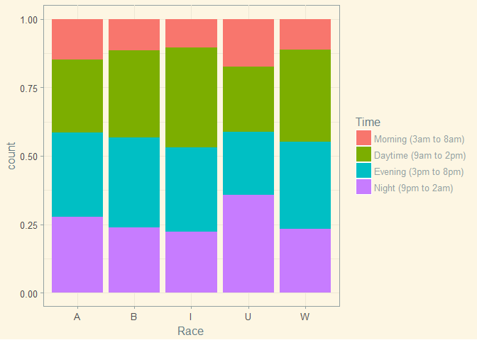

``` r
# looks like race "U" has more arrests at night

ggplot(data = arrests, aes( x = Race, fill = Weekday)) + geom_bar(position = "fill") +
    theme_stata() + scale_fill_stata() + theme(legend.position = "top") + 
    labs(x = "Race", y = "Number of Arrests")
```

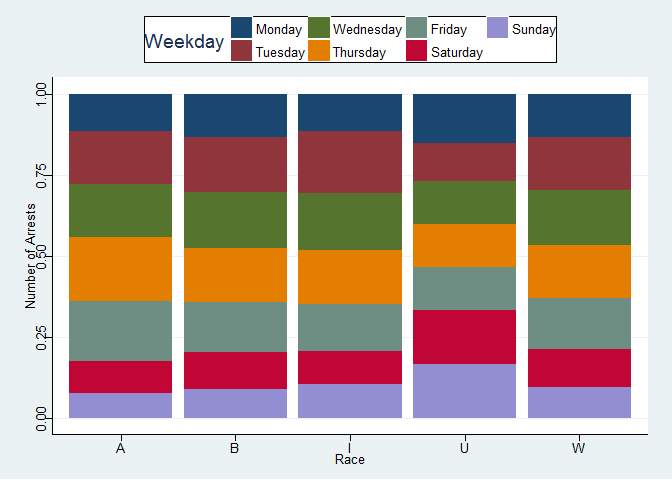

``` r
ggplot(data = arrests, aes( x = Race, fill = Month)) + geom_bar(position = "fill")  +
    theme_stata() + scale_fill_stata() + theme(legend.position = "top") + 
    labs(x = "Race", y = "Number of Arrests")
```

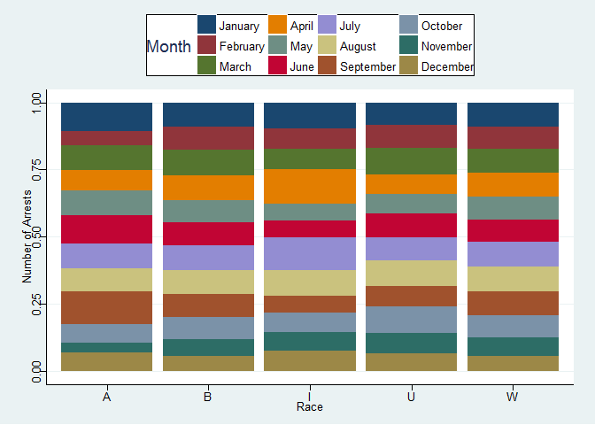

``` r
ggplot(data = arrests, aes( x = Race, fill = Year)) + geom_bar(position = "fill") +
    theme_stata() + scale_fill_stata() + theme(legend.position = "top") + 
    labs(x = "Race", y = "Number of Arrests")
```

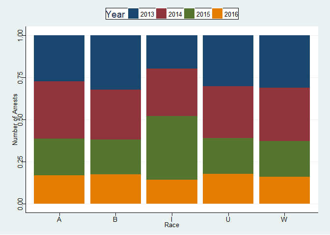

``` r
ggplot(data = subset(arrests, !is.na(arrests$District)), aes( x = Race, fill = District)) + 
    geom_bar(position = "fill") +
    theme_stata() + scale_fill_stata() + theme(legend.position = "right") + 
    labs(x = "Race", y = "Number of Arrests")
```

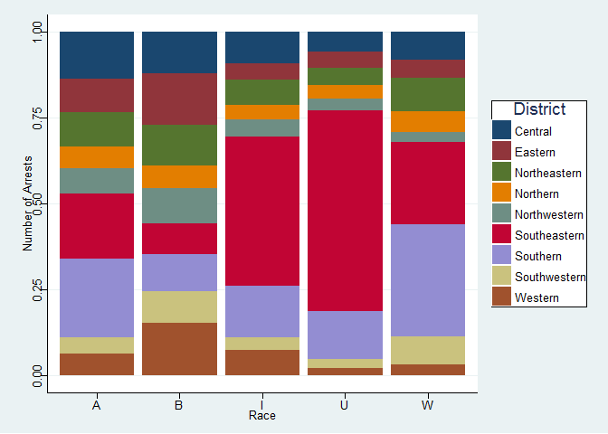

``` r
# offences

ggplot(data = top.offences, aes(x = IncidentOffense, y = offence.count, fill = IncidentOffense)) + 
    geom_bar(stat = "identity") + scale_x_discrete(labels = offence.label) + 
    labs(x = "Offence Type", y = "Number of Arrests")  + theme_light() +
    theme(legend.position = "none")
```

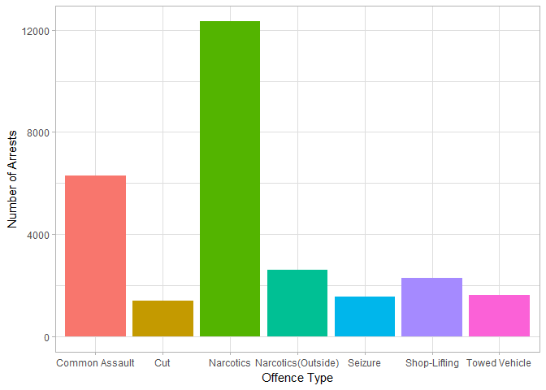

``` r
ggplot(data = arrests, aes(x = District, fill = Race)) + 
    geom_bar(position = "stack") + labs(x = "Offence Type", y = "Number of Arrests") + 
    coord_cartesian(ylim = c(0,11000))
```

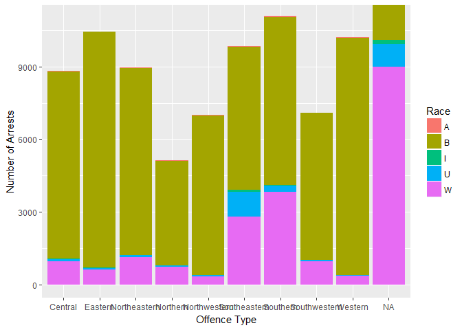

``` r
ggplot(data = arrests, aes(x = District, fill = Race)) + 
    geom_bar(position = "fill") + labs(x = "Offence Type", y = "Number of Arrests") 
```

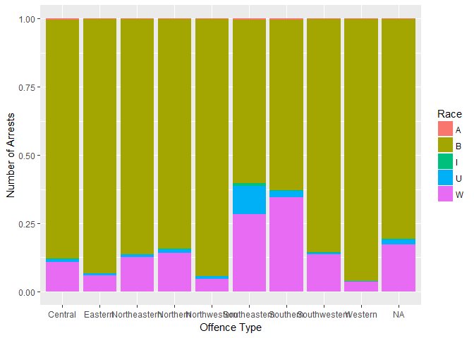

``` r
# hour

ggplot(data = subset(arrests, !is.na(arrests$Hour)), aes( x = Hour)) + geom_bar(fill = "#37505C") +
    labs(x = "Time of day" , y = "Arrest Count")
```

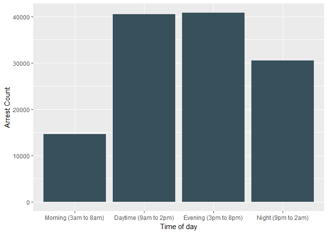

``` r
ggplot(data = subset(arrests, !is.na(arrests$Hour) & !is.na(arrests$District) & 
        arrests$IncidentOffense %in% top.offences$IncidentOffense),
        aes(x = Hour, fill = IncidentOffense)) + 
        geom_bar(position = "fill") +
        scale_fill_manual(guide = guide_legend("Offence Type"),
        labels = offence.label, values = custom.color) +
        labs(x = "Time of day" , y = "Arrest Count")
```

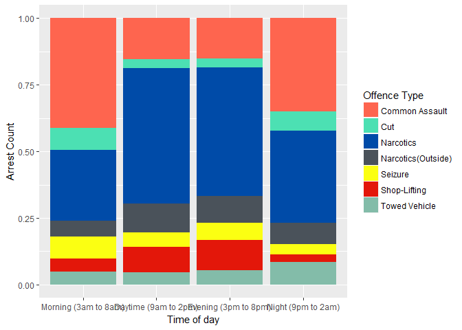

``` r
# month

ggplot(data = arrests, aes(x = Month)) + geom_bar(fill = "#37505C") +
    labs(x = "Month" , y = "Arrest Count")
```

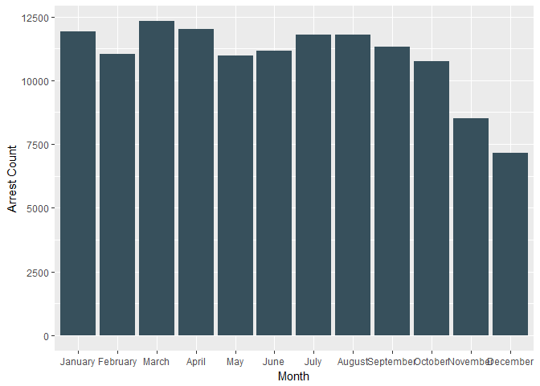

``` r
ggplot(data = subset(arrests, !is.na(arrests$Hour) & !is.na(arrests$District) & 
    arrests$IncidentOffense %in% top.offences$IncidentOffense), aes(x = Month)) + 
    geom_bar(position = "fill", aes(fill = IncidentOffense)) +
    scale_fill_manual(guide = guide_legend("Offence Type"), labels = offence.label, values = c(
        "#FE654F","#4CE0B3","#004BA8","#4A525A","#FBFF12","#E3170A","#83BCA9")) +
    labs(x = "Month" , y = "Arrest Count")
```

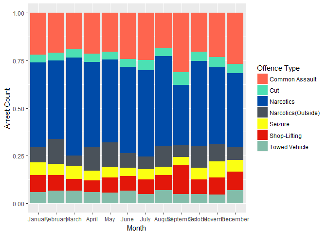

``` r
ggplot(data = arrests, aes(x = Month)) + geom_bar(aes(fill = Year), position = "fill") +
    labs(x = "Month" , y = "Arrest Count")
```

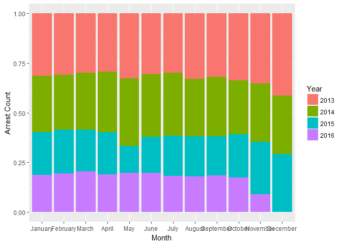

``` r
# weekday

ggplot(data = arrests, aes( x = Weekday)) + geom_bar(fill = "#F76F8E")+
    labs(x = "Weekday" , y = "Arrest Count")
```

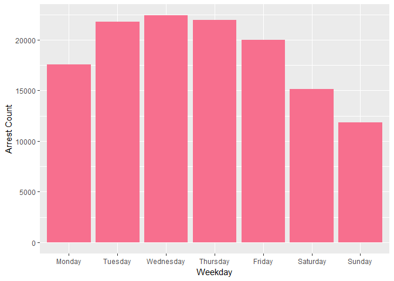

``` r
ggplot(data = subset(arrests, arrests$IncidentOffense %in% 
    top.offences$IncidentOffense), aes( x = Weekday, fill = IncidentOffense )) + 
    geom_bar(position = "fill") +
    scale_fill_manual(guide = guide_legend("Offence Type"),
    labels = offence.label, values = custom.color) +
    labs(x = "Weekday" , y = "Arrest Count")
```

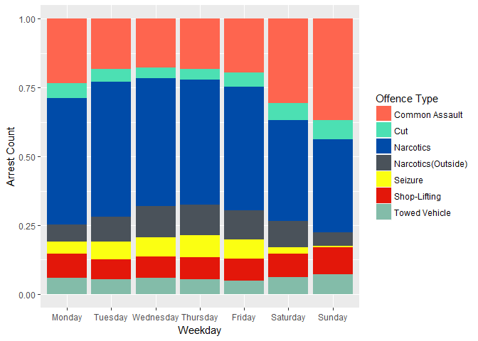

``` r
ggplot(data = subset(arrests, !is.na(arrests$Hour)), aes( x = Weekday, fill = Hour)) + 
    geom_bar(position = "fill") + scale_fill_discrete(guide = guide_legend("Time")) +
    labs(x = "Weekday" , y = "Arrest Count")
```

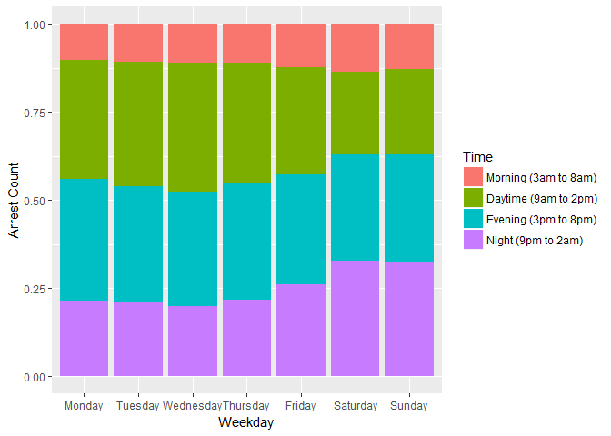

``` r
# year


ggplot(data = arrests, aes(x = Year)) + geom_bar(fill = "#17255A") +
    labs(x = "Year" , y = "Arrest Count")
```

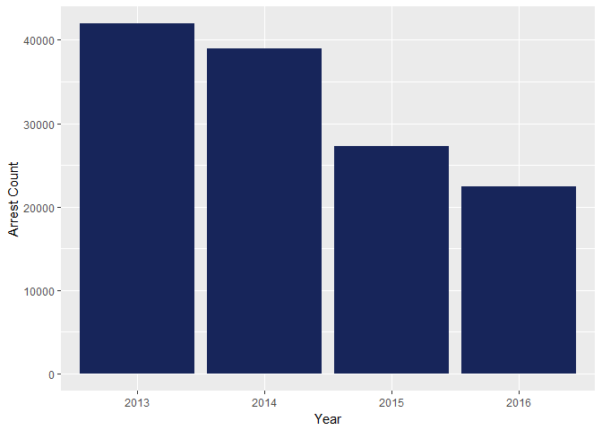

``` r
ggplot(data = subset(arrests, arrests$IncidentOffense %in% top.offences$IncidentOffense),
    aes(x = Year, fill = IncidentOffense)) + geom_bar(position = "fill") +
    labs(x = "Year" , y = "Arrest Count") + 
    scale_fill_manual(values = custom.color,
    labels = offence.label)
```

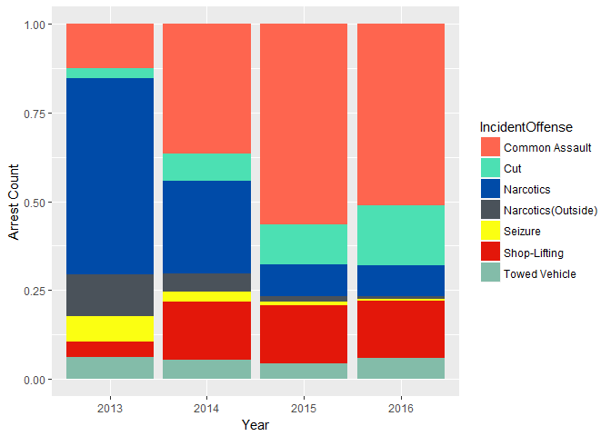

#### Data Source: <https://data.baltimorecity.gov/Public-Safety/BPD-Arrests/3i3v-ibrt>

I have tried to analyze as much as possible. Please feel free to share your visualizations and analysis with me. You can contact me at <arathee2@gmail.com> in case you want to share or suggest something regarding the analysis.
----------------------------------------------------------------------------------------------------------------------------------------------------------------------------------------------------------------------------------
